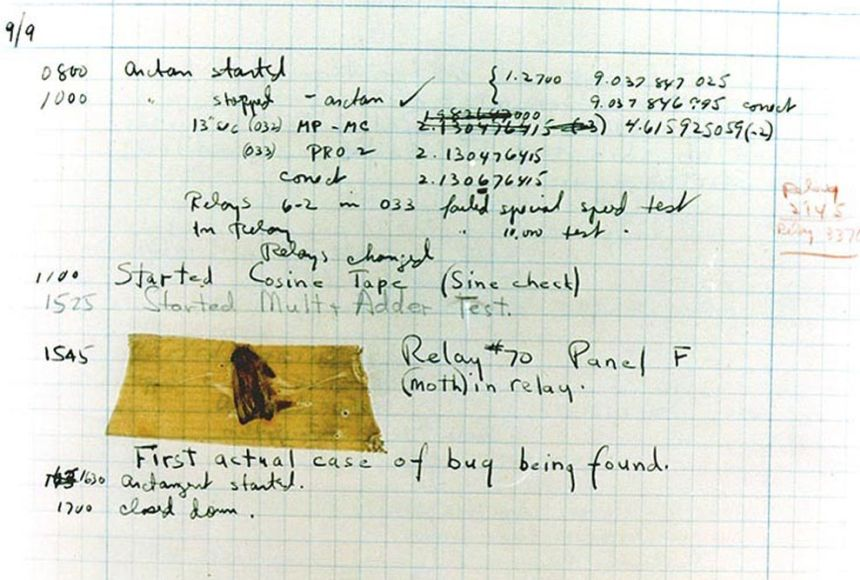
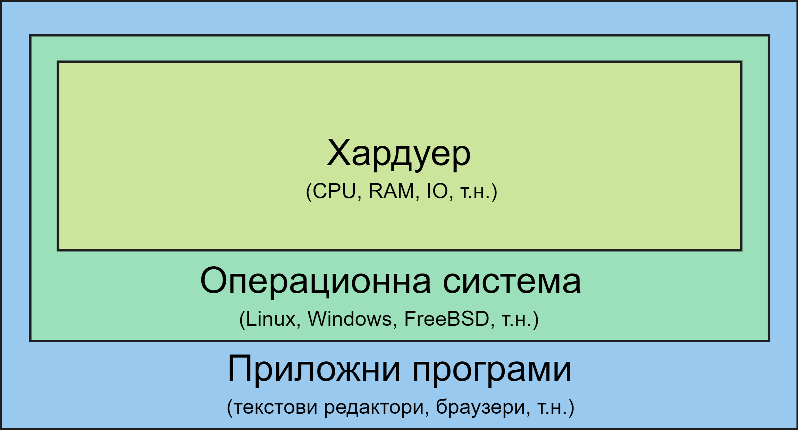
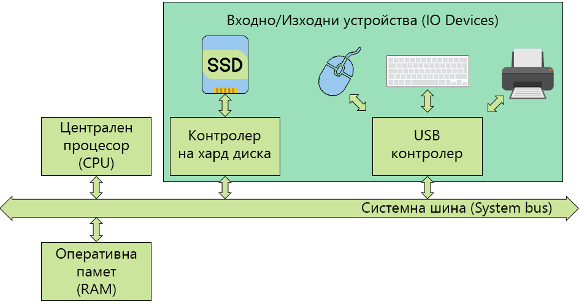
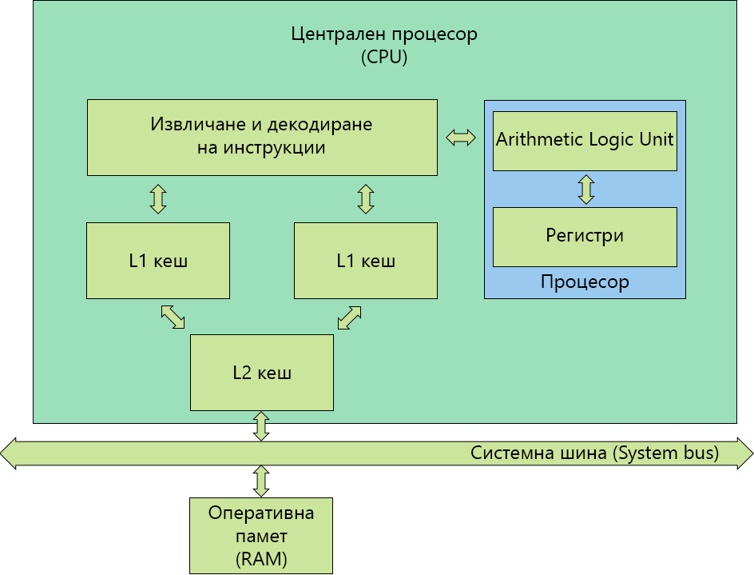

# Тема 1: История и структура на компютърните системи

1. Кратка история на компютърните системи
    - 19-ти век
        - Първоначално Чарлз Бабидж разработва "разностно устройство", което може да се разглежда като механичен калкулатор
        - След това проектира и се опитва да построи "аналитично устройство" през 1837 г.
        - Реализиран е няколко години по-късно през 1841 г.
        - <br>
        Аналитично устройство на Чарлз Бабидж

    - 1940-те г.
        - Първите електронни компютри
        - Рабързаният прогрес се дължи на напредъка на електронни компоненти през 30-те години (релета, вакумни лампи, кондензатори) и Втората световна война
        - Програмират се с перфокарти
        - <br>
        Fun fact: първият компютърен бъг е открит 1947 г. и е бил... истинска бубoлечка

    - 1950-те г.
        - Започват да се използват транзистори вместо вакумни лампи
        - Има няколко проблема с компютърните системи:
            - всяка програма трябва да се пише за конкретния модел машина върху който ще се изпълнява
            - също така, програмата трябва да работи директно с хардуерните ресурси, без никаква абстракция 
        - Първата операционна система - GMOS
            - Разработена от General Motors за IBM 701
        - Първият публично достъпен програмен език - Fortran
    
    - 1960-те г.
        - Първите интегрални схеми – микрочипове, като компютри, които ги използват се появяват през 1963 г.
        - Многозадачност - в оперативната памет едновременно се намират няколко задания; когато някое от заданията чака за изпълнение на входно/изходна операция, процесорът може да премине към обработване на друго задание
        - Времеделение - времето на процесора се разделя между всички потребители
        - Началото на работа по Unix - 1969 г.

    - 1970-те г.
        - Започва ерата на персоналните компютри
        - Първият прототип на графичен потребителски интерфейс (GUI)
            - Разработен от Xerox Palo Alto Research Center през 1979 г.
            - Стив Джобс, търсейки нови идеи за работа в бъдещи итерации на Apple компютрите, дава 1 мил. долара акции на Xerox, в замяна за подробна обиколка на техните съоръжения и текущи проекти.

    - 1980-те г.
        - MS DOS (1981 г.), Microsoft Windows 1.0 (1985 г.)
        - Apple Lisa (1983 г.) - първият компютър на Apple с мишка и GUI
    
    - 1990-те г.
        - NeXTStep (1991 г.) операционната система, която по-късно става macOS
        - Linux (1991 г.)
            - "I'm doing a (free) operating system (just a hobby, won't be a big and professional like gnu)" - Линус Торвалдс
            - [Why so many distros? The Weird History of Linux - Fireship](https://youtu.be/ShcR4Zfc6Dw)

2. Какво е операционна система?
    <br>
    Фиг. 2.1.: Обща структура на компютърна система

    - За жалост, няма общоприета конкретна дефиниция за ОС.
    - Операционната система контролира хардуера на системата.
    - Също така предоставя недиректен достъп на програмите към хардуера
        - Операционната система предоставя съвкупност от функции, които програмите могат да използват
        - Пример: Програмата няма директен достъп за писане и четене върху харддиска на машината, но може да ги използва с функциите `read()`, `write()` и т.н.
        - Ще се запознаем с това по-подробно на първото практическо упражнение

3. Какво представлява хардуера на една компютърна система?
    <br>
    Фиг. 3.1.: Пример за структура на хардуера на компютърна система

    Всяка компютърна система съдържа следните 4 компонента:
    - Централен процесор (CPU)
        - Изпълнява инструкии, обработва данни, изчислява
        - Чрез него ОС контролира останалите компоненти

    - Оперативна памет (RAM)
        - Памет върху която можем да записваме информация и да я четем
        - Използва се за запазване на иструкции към процесора и данни на приложните програми/операционната система (малко по-подробно в следващата точка)
        - Енергозависима - информацията не се пази при изключване на системата

    - Входно/Изходни устройства (IO Devices)
        - Устройства, с които операционната система може да комуникира - да изпраща информация към тях или да получава информация от тях.
        - Примери за входно-изходни устройства са мишките, принтерите, мониторите, записващите устройства, като HDD, SSD и т.н.
        - В частност ще разгледаме записващите устройства:
            - Енергонезависима - информацията се запазва, дори и системата да бъде изключена
            - По-бавни и по-обемни от оперативната памет

    - Системна шина (System bus)
        - Компонент чрез който се извършва комуникацията между останалите компоненти

    ОС управлява хардуера и предоставя достъп на програмите чрез API (приложно-програмен интерфейс). Примери:
        - malloc() и free()
        - виртуалната адресна таблица
            - спиране при опит за достъп на памет върху която нямаме право
        - достъпване на файлове с read() и write()
            - файловете имат права за достъп
        - TODO: разпиши по-подробно примерите

4. Какво се случва в процесора?
    <br>
    Фиг. 4.1.: Структура на централния процесор

5. Регистри на процесора
    - Регистри с общо предназначение.
        - Достъпни са за всички програми.
        - Могат да се адресират като се използва асемблер
        
            Пример:
            ```
            MOV AX, 42
            ```

            `MOV` е кратък код за инструкцията за "преместване". Използва се за копиране на данни от едно място на друго. `AX` е регистър. `,` е разделител, а `42` е константа, която се премества в регистъра AX. 
        
        - Има два типа:
            - Регистри за данни.
            - Адресни регистри:
                - Използват се за реализация на различни схеми за адресация
                - Използват се за индексанция и указатели

    - Контролни регистри
        - Използват се от процесора за да контролират работата му
        - Използват се от операционната система за да контролират изпълнението на приложните програми
        - Не са достъпни директно от потребителските програми
        - Примери за контролни регистри са:
            - Програмен брояч (Program Counter – PC)
                - Съдържа адреса на следващата инструкция, която трябва да бъде извлечена
            - Регистър за инструкция (Instruction Register – IR)
                - Съдържа последната извлечена от паметта инструкция
            - Регистър на състоянието (Program Status Word – PSW)
                - Резултат от сравнения
                - Разрешаване и забрана на прекъсванията
                - Потребителски режим и защитен режим на процесора

6. Управление на IO устройства
    
    В последната точка се споменава, че регистърът за състоянието се използва "разрешаване и забрана на прекъсванията". Но какво всъщност представляват прекъсванията?

    - Има няколко начина за управление на входно/изходните устройства от процесора:
        - Синхронно изпълнение на входно/изходните операции (Programmed IO)
        - Асинхронно изпълнение на входно/изходните операции (Interrupt-Driven IO)
        - Пряк достъп до паметта (Direct Memory Access)
            - Прекият достъп до паметта съществено подобрява скоростта на трансфер на данни между входно/изходните устройства и оперативната памет
            - Типично прекият достъп до паметта (DMA) се използва от бързи входно изходни устройства – твърди дискове, мрежови контролери и т.н.
            - Контролерът на устройството прехвърля блок от данни директно в/от оперативната памет без намеса на централния процесор
            - Генерира се само едно прекъсване за целия блок от данни


7. Прекъсвания
    -  Обработка на прекъсванията
        - Прекъсват нормалната последователност на изпълнение на команди от процесора.
        - Прекъсването предава управлението на функцията за обработване
        на прекъсването.
        - Прекъсването на обработваното задание става по такъв начин, че да е възможно възстановяване на неговата обработка.
        - Операционната система запазва състоянието на процесора като запазва регистрите, програмния брояч и т.н.
        - Определя какъв е видът на прекъсването и къде точно трябва да се предаде управлението за да се обработи възникналото прекъсване.

    - Видове прекъсвания
        - Софтуерни прекъсвания (trap):
            - препълване при аритметични операции
            - делене на нула
            - изпълнение на неправилна инструкция
            - опит за достъп до защитена част от паметта
        - Прекъсвания от таймера
        - Прекъсвания от входно/изходните устройства.
        - Прекъсвания предизвикани от повреди в хардуера

    - Обработка на много прекъсвания
        - Става последователно, като може да е в реда на постъпване на прекъсванията или по приоритет на прекъсванията

8. Харуерна поддръжка на ОС
    - Минимум два режима на процесора
        - 
        Нива на защита в модерните операционни системи