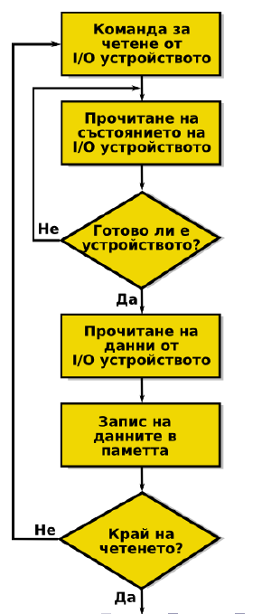
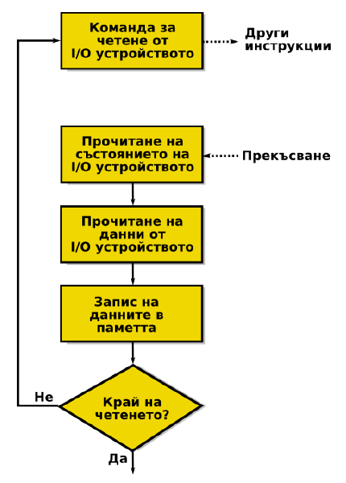
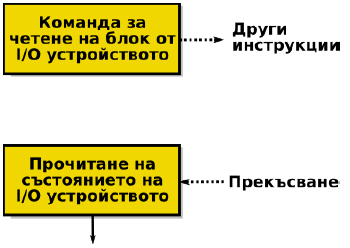
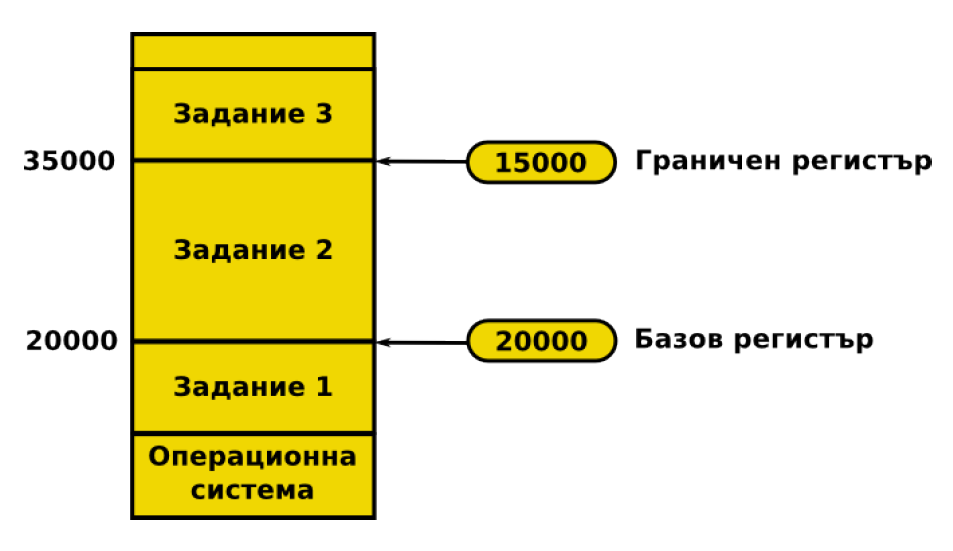

# Тема 1: История и структура на компютърните системи

## Съдържание
1. [Кратка история на компютърните системи](#1-кратка-история-на-компютърните-системи)
2. [Какво е операционна система?](#2-какво-е-операционна-система)
3. [Какво представлява хардуера на една компютърна система?](#3-какво-представлява-хардуера-на-една-компютърна-система)
4. [Какво се случва в процесора?](#4-какво-се-случва-в-процесора)
5. [Видове регистри на процесора](#5-видове-регистри-на-процесора)
6. [Управление на IO устройства](#6-управление-на-io-устройства)
7. [Прекъсвания (Interrupts)](#7-прекъсвания-interrupts)
8. [Харуерна поддръжка на операционните системи](#8-харуерна-поддръжка-на-операционните-системи)
---

## I. Кратка история на компютърните системи
**Бележка:** Точката няма да се включва в тестове/изпитите по предмета. Тя служи само за въведение в 

- **19-ти век**
    - Първоначално Чарлз Бабидж разработва "разностно устройство", което може да се разглежда като механичен калкулатор
    - След това проектира и се опитва да построи "аналитично устройство" през 1837 г.
    - Реализирано е няколко години по-късно през 1841 г.
    
    *Фиг. 1.1. Аналитично устройство на Чарлз Бабидж*

- **1940-те г.**
    - Първите електронни компютри
    - Рабързаният прогрес се дължи на напредъка на електронни компоненти през 30-те години (релета, вакумни лампи, кондензатори) и Втората световна война
    - Програмират се с перфокарти
    - Fun fact: първият компютърен бъг е открит 1947 г. и е бил... истинска бубoлечка
    
    *Фиг. 1.2. Първият компютърен бъг*

- **1950-те г.**
    - Започват да се използват транзистори вместо вакумни лампи
    - Има няколко проблема с компютърните системи:
        - всяка програма трябва да се пише за конкретния модел машина върху който ще се изпълнява
        - също така, програмата трябва да работи директно с хардуерните ресурси, без никаква абстракция 
    - Първата операционна система - GMOS
        - Разработена от General Motors за IBM 701
    
- **1960-те г.**
    - Първите интегрални схеми – микрочипове, като компютри, които ги използват се появяват през 1963 г.
    - Многозадачност - в оперативната памет едновременно се намират няколко задания; когато някое от заданията чака за изпълнение на входно/изходна операция, процесорът може да премине към обработване на друго задание
    - Времеделение - времето на процесора се разделя между всички потребители
    - Началото на работа по Unix - 1969 г.

- **1970-те г.**
    - Започва ерата на персоналните компютри
    - Първият публично достъпен програмен език - Fortran
    - Първият прототип на графичен потребителски интерфейс (GUI)
        - Разработен от Xerox Palo Alto Research Center през 1979 г.
        - Стив Джобс, търсейки нови идеи за работа в бъдещи итерации на Apple компютрите, дава 1 мил. долара акции на Xerox, в замяна за подробна обиколка на техните съоръжения и текущи проекти.

- **1980-те г.**
    - MS DOS (1981 г.), Microsoft Windows 1.0 (1985 г.)
    - Apple Lisa (1983 г.) - първият компютър на Apple с мишка и GUI
    
- **1990-те г.**
    - NeXTStep (1991 г.) операционната система, която по-късно става macOS
    - Linux (1991 г.)
        - "I'm doing a (free) operating system (just a hobby, won't be a big and professional like gnu)" - Линус Торвалдс
        - [Why so many distros? The Weird History of Linux - Fireship](https://youtu.be/ShcR4Zfc6Dw)

## 2. Какво е операционна система?

<br>
*Фиг. 2.1.: Обща структура на компютърна система*

- За жалост, няма общоприета конкретна дефиниция за ОС.
- Операционната система контролира хардуера на системата.
- Също така предоставя недиректен достъп на програмите към хардуера
    - Операционната система предоставя съвкупност от функции, които програмите могат да използват
    - Пример: Програмата няма директен достъп за писане и четене върху харддиска на машината, но може да ги използва с функциите `read()`, `write()` и т.н.
    - Ще се запознаем с това по-подробно на първото практическо упражнение

## 3. Какво представлява хардуера на една компютърна система?
<br>
*Фиг. 3.1.: Пример за структура на хардуера на компютърна система*

Всяка компютърна система съдържа следните 4 компонента:
- **Централен процесор (CPU)**
    - Изпълнява инструкии, обработва данни, изчислява
    - Чрез него ОС контролира останалите компоненти

- **Оперативна памет (RAM)**
    - Памет върху която можем да записваме информация и да я четем
    - Използва се за запазване на иструкции към процесора и данни на приложните програми/операционната система (малко по-подробно в следващата точка)
    - Енергозависима - информацията не се пази при изключване на системата

- **Входно/Изходни устройства (IO Devices)**
    - Устройства, с които операционната система може да комуникира - да изпраща информация към тях или да получава информация от тях.
    - Примери за входно-изходни устройства са мишките, принтерите, мониторите, записващите устройства, като HDD, SSD и т.н.
    - В частност ще разгледаме записващите устройства:
        - Енергонезависима памет - информацията се запазва, дори и системата да бъде изключена
        - По-бавни и по-обемни от оперативната памет

- **Системна шина (System bus)**
    - Компонент чрез който се извършва комуникацията между останалите компоненти

ОС управлява хардуера и предоставя достъп на програмите чрез API (приложно-програмен интерфейс). Този интерфейс също така поставя ограничения до какво имат достъп потребителските програми.

Примери:
- `malloc()` и `free()` за заделяне на динамична памет
    - операционната система решава, дали програмата има право да задели тази памет
- виртуалната адресна таблица
    - спиране при опит за достъп на памет върху която нямаме право да променяме
- достъпване на файлове с `read()` и `write()`
    - файловете имат права за достъп, т.е. операционната система може да ни върне грешка при използването на тези команди

## 4. Какво се случва в процесора?
<br>
*Фиг. 4.1.: Структура на централния процесор*

- **ALU - Аритметико-логическия блок (Arithmetic Logic Unit)**
    - Използва сe за извършване на аритметични операции и логически операции – събиране, изваждане, умножение, деление и сравняване на две числа
    - Обработва данните от регистрите на процесора
    - От него зависи скоростта на изчислителния процес
    - Изграден е от логически елементи - `OR`, `NOR`, `AND`, `NAND`, `XOR`, `NOT`, т.н. (които логически елементи са изградени от транзистори)

- **Регистри (Registers)**
    - Те са най-бързата памет в една компютърна система
    - Използват се при изчисленията на от аритметико-логическия блок
    - Разделят на 2 вида
        - Регистри с общо предназначение
        - Контролни регистри
        - Виж т.5. за повече информация

- **Кеш памет (Cache Memory)**
    - Малка, но доста бърза памет
    - Използва се за да се запазят данните, които са използвани най-често при изпълнение на инструкции от процесора, за да се ускори достъпа до тях
    - Това се налага, защото извличането на данни от RAM паметта е скъпа операция (т.е. става доста бавно), в сръвнение от това да се извика от кеш паметта
    - Kеш паметта бива на няколко нива L(evel)1, L2 и L3 (L3 от 2003 година, с Pentium 4 Extreme Edition)

    - **L1 кеш**
        - Директно комуникира с регистрите.
        - Разделя на 2 части
            - L1D (Data) - за съхраняване на стойности като числа, адреси, т.н., които са използвани най-често
            - L1I (Instruction) - за съхранение на инструкциите, които са използвани най-често
            - L1I минава през процес на извличане и декодиране на самите инструкции.
            - Типичният размер на L1 кеша е от 16KB до 1MB

    - **L2 и L3 кеш**
        - Те представляват медиаторите между L1 и RAM паметта
        - По-бавни са от L1, но са в пъти по-бързи от RAM паметта.
        - По-големи са от L1 - с размери от L2 от 256KB до 64MB


## 5. Видове регистри на процесора

Процесорните регистри се разделят на два типа:
- **Регистри с общо предназначение**
    - Достъпни са за всички програми
    - Могат да се адресират като се използва асемблер
    
        Пример:
        ```
        MOV AX, 42
        ```

        `MOV` е кратък код за инструкцията за "преместване". Използва се за копиране на данни от едно място на друго. `AX` е регистър. `,` е разделител, а `42` е константа, която се премества в регистъра AX
    
    - Има два подтипа регистри с общо предназначение
        - Регистри за данни
            - Използват се за променливи
        - Адресни регистри
            - Използват се за реализация на различни схеми за адресация
            - Използват се за индексанция и указатели

- **Контролни регистри**
    - Използват се от процесора за да контролират работата му
    - Използват се от операционната система за да контролират изпълнението на приложните програми
    - Не са достъпни директно от потребителските програми
    - Примери за контролни регистри са:
        - Програмен брояч (Program Counter – PC)
            - Съдържа адреса на следващата инструкция, която трябва да бъде извлечена
        - Регистър за инструкция (Instruction Register – IR)
            - Съдържа последната извлечена от паметта инструкция
        - Регистър на състоянието (Program Status Word – PSW)
            - Резултат от сравнения
            - Разрешаване и забрана на прекъсванията (виж т.7.)
            - Потребителски режим и защитен режим на процесора (виж т.8.)

## 6. Управление на IO устройства

В последната точка се споменава, че регистърът за състоянието се използва "разрешаване и забрана на прекъсванията". Но какво всъщност представляват прекъсванията?

- Има няколко начина за управление на входно/изходните устройства от процесора:
    - **Синхронно изпълнение на входно/изходните операции (Programmed IO)**
        - Нарича се синхронно, защото операционната система не прави нищо друго, освен да чака, докато не получи сигнал, че работата е свършила.
        - Oперационната система непрекъснато проверява дали IO устройството е свършило определена задача.
        - Влиза се в безкраен цикъл, на изпращане на заявки към устройството, дали е свършило работата. Този цикъл едва ще приключи  чак когато чак когато устройството си свърши работата.
        - Тогава то дава резултата в буфер, който операционната система прехвърля в оперативната памет.

            <br>
            *Фиг. 6.1.: Синхронно изпълнение на входно/изходните операции (Programmed IO)*

    - **Асинхронно изпълнение на входно/изходните операции (Interrupt-Driven IO)**
        - Процесорът се обръща към контролера на входно/изходното устройство и подава заявка за извършване на операцията.
        - След подаване на заявката, процесорът е свободен да се занимава с други задачи.
        - Когато изпълнението на операцията завърши, контролерът на входно/изходното устройство прекъсва работата на процесора.
        - Процесорът трябва да прехвърли данните от буферите на контролера в оперативната памет или регистрите си.

            <br>
            *Фиг. 6.2.: Асинхронно изпълнение на входно/изходните операции (Interrupt-Driven IO)*

    - **Пряк достъп до паметта (Direct Memory Access)**
        - Прекият достъп до паметта съществено подобрява скоростта на трансфер на данни между входно/изходните устройства и оперативната памет.
        - Типично прекият достъп до паметта (DMA) се използва от бързи входно изходни устройства – твърди дискове, мрежови контролери и т.н.
        - Контролерът на устройството прехвърля блок от данни директно в/от оперативната памет без намеса на централния процесор.
        - Генерира се само едно прекъсване за целия блок от данни.

            <br>
            *Фиг. 6.3.: Пряк достъп до паметта (Direct Memory Access)*


## 7. Прекъсвания (Interrupts)
- Както видяхме при асинхронното обработване на IO операции, нормалната работа на процесора може да бъде прекъсната от прекъсвания (Interrupt).

- **Обработка на прекъсванията**
    - Прекъсват нормалната последователност на изпълнение на команди от процесора (от там идва и името им)
    - Когато се появи прекъсване, процесорът преминава в защитен режим на работа
    - Прекъсването на настоящата задача на процесора става по такъв начин, че да е възможно възстановяване на нейната обработка след обработката на прекъсването, т.е. запазва състоянието на процесора като запазва регистрите, програмния брояч и т.н.
    - След това ОС трябва да се реши дали ще се обработи това прекъсване
        - ако не, процесорът се връща в състоянието си преди прекъсването
        - ако да, първо запазва състоянието си на работа в момента и след това обработва прекъсването, т.е. изпълнява конкретна функция в зависимост от вида на прекъсването

    - За всеки тип прекъсване има Interrupt handler. Прекъсванията се пазят в приоритетна опашка. Interrupt handler се пази в оперативната памет.
    - Прекъсване не може да прекъсне обработката на друго прекъсване

- **Видове прекъсвания**
    - Софтуерни прекъсвания (trap):
        - препълване при аритметични операции
        - делене на нула
        - изпълнение на неправилна инструкция
        - опит за достъп до защитена част от паметта
    - Прекъсвания от таймера
    - Прекъсвания от входно/изходните устройства.
    - Прекъсвания предизвикани от повреди в хардуера

- **Обработка на много прекъсвания**
    - Става последователно, като може да е в реда на постъпване на прекъсванията или по приоритет на прекъсванията

## 8. Харуерна поддръжка на операционните системи
- Компютърните системи съдържат хардуерни механизми, които:
    - позволяват на операционната система да изпълнява основните си функции бързо.
    - позволяват на операционната система стриктно да прилага механизми за защита на информацията.

- Основните механизми за защита, използвани в компютърните системи са:
    - Два режима на работа на процесора
        - Поделянето на ресурсите на операционната система изисква изграждането на механизми, които да не позволяват на некоректно работеща програма да наруши правилната работа на другите програми.
        - Хардуерно в централния процесор типично се реализират поне два режима на работа:
            - **Потребителски режим** - в този режим може да се изпълнява само част от инструкциите на процесора, които се считат за безопасни. Това е режимът в който работят потребителските програми.
            - **Режим на ядрото (привилегирован режим, защитен режим)** – могат да се изпълняват всички инструкции на процесора. Това е режимът в който работи операционната система.
        
    - Защита на паметта
        - Не позволява на процесите достъп до участъците от паметта, които не принадлежат на тях.
        - Добавят се два регистъра, които определят областта от паметта, която програмата може да използва:
            - **Базов регистър (base register)** – съдържа най-малкия адрес в паметта, който е достъпен (разрешен).
            - **Граничен регистър (limit register)** – съдържа размера на разрешения за използване участък от паметта.
        - Паметта, която е извън така дефинирания участък е защитена – докато е в потребителски режим процесорът няма достъп до нея.

        <br>
        Базов и граничен регистър на процес в оперативната памет
    
    - Защита на входно/изходните операции
        - Не бива да позволява на потребителската програма да получи контрол върху процесора в привилегирован режим.
        - Всички инструкции за изпълнение на входно/изходни операции се изпълняват само в привилегирован режим на процесора.
        - Прекъсвания
            - Повечето входно/изходни устройства изпращат прекъсване на процесора в случай, че настъпи някакво събитие – приключване на входно/изходна операция или хардуерна грешка.
            - При обработване на прекъсване процесорът се превключва в привилегирован (защитен) режим.
            - Обработването на прекъсването е работа на операционната система.
    
    - Защита на централния процесор
        - Таймери
            - Таймерите се използват при реализация на времеделене
            - Тяхната цел е да не позволяват на един процес да монополизира централния процесор
            - Таймерите генерират прекъсване към процесора след изтичането на определен период от време. След това оперционната система сменя контекста на процесора с друг процес (дава време на друг процес да се изпълнява)


