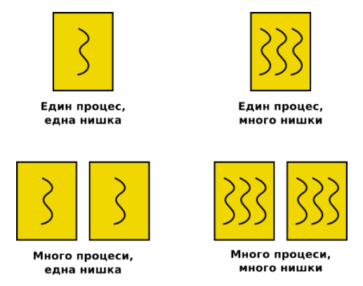
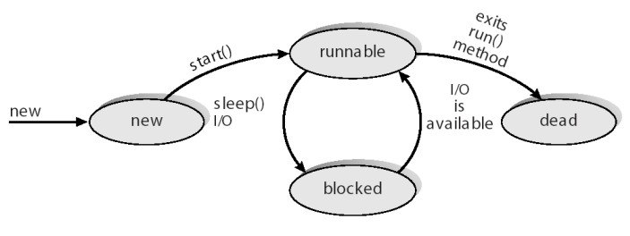
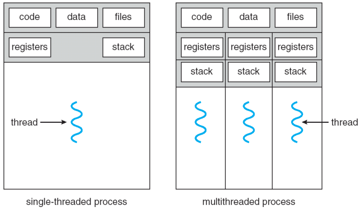
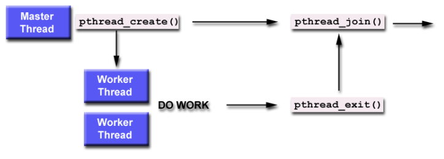

# Тема 3. Нишки и синхронизация

Съдържание:

1. [Нишки](#1-нишки)
2. [POSIX Pthreads стандартната библиотека](#2-posix-pthreads-стандартната-библиотека)
3. [Синхронизация между нишки](#3-синхронизация-между-нишки)
---

## 1. Нишки
 
Фиг. 1.1. Нишки и процеси

- Съвременните операционни системи поддържат изпълнението на много нишки в рамките на един процес.
- Нишките на един процес се изпълняват паралелно.
- Всяка нишка притежава състояние:
    - Нова
    - В изпълнение
    - Блокирана
    - Унищожена

 
Фиг. 1.2. Състояния на нишките

- Нишките имат достъп до паметта и всички ресурси на процеса, в който се изпълняват.Ресурсите на процеса са общи за всички нишки.
- Нишките притежават и локална за нишките памет – т.е. те могат да съхраняват стойности, които са локални за нишката (не се виждат от другите нишки).
- Нишките, които са част от един и същ процес, си поделят адресното пространство и файловете, и поради това те могат да комуникират без обръщане към ядрото.

 
Фиг. 1.3. Разпределение на ресурсите на даден процес, при употребата на една или няколко нишки

## 2. POSIX Pthreads стандартната библиотека
- POSIX Pthreads е стандартна за UNIX операционните системи, която дефинира стандартно API за създаване на нишки и синхронизация.
- Първоначално главната функция main() разполага с единствена нишка – нишката на процеса. Всички останали нишки трябва изрично да бъдат създадени.
- Функцията `pthread_create()` се използва за създаване на нова нишка. Тази функция може да се вика произволен брой пъти от всяка точка на програмата.
    - Приема 4 аргумента:
        - `thread` – уникален идентификатор на създадената нишка.
        - `attr` – специфицира атрибутите на нишката.
        - `start_routine` – функция, която се изпълнява от нишката при нейното стартиране.
        - `arg` – аргумент, който се предава на функцията `start_routine`.
    - За повече информация - `man pthread_create`.
    - Ако нямате manual pages за pthread, трябва да инсталирате `manpages-posix` и `manpages-posix-dev` пакетите.
- Веднъж създадени, нишките са равнопоставени, и могат да създавата други нишки. Няма йерархия или зависимост между нишките.

- Има няколко начина, по които една Pthread нишка може да бъде унищожена:
    - Функцията, която се изпълнява от нишката завършва нормално работата си и извиква return.
    - Функцията, която се изпълнява от нишката извиква библиотечната функция `pthread_exit()`.
    - Нишката може да бъде спряна от друга нишка като се използва библиотечната функция `pthread_cancel()`.
    - Когато процеса, в който живее нишката, бъде унищожен, се унищожавт и всички негови нишки.

- Също така, може да се изчака приключването на нишка от друга нишка, чрез `pthread_join()`
    - Функцията `pthread_join()` блокира нишката, която я извиква, докато нишката с даден идентификатор не завърши работа.
    - Всяка нишка може да бъде присъединена само веднъж. Опитът една нишка да бъде присъединена няколко пъти е логическа грешка.

 
Фиг. 2.1. Присъединяване на нишки

## 3. Синхронизация между нишки

1. Условие за надпревара (Race condition)
    - Условие на надпревара (race condition) се нарича ситуацията, при която няколко нишки конкурентно манипулират данни, които са общи.
    - За да се предотврати създаването на условие за надпревара (race condition), конкурентните нишки трябва да бъдат синхронизирани.
    - [Why Computers Can't Count Sometimes](https://youtu.be/RY_2gElt3SA)

2. Атомарни операции
    - Атомарна се нарича операция, която се изпълнява изцяло, без да бъде прекъсвана от операционната система.

3. Критична секция
    - Ако няколко нишки трябва да достъпят общ ресурс, всяка нишка има участък от кода, в който работи с общите за всички нишки данни. Такъв участък от кода се нарича критична секция.
    - Трябва да се изгради механизъм, чрез който да се гарантира, че когато един процес се намира в критична секция, никой друг процес не може да влезе в своята критична секция.
    - Този механизъм трябва да притежава следните свойства:
        - Взаимно изключване: когато нишката `T` се намира в критична секция, никоя друга нишка не може да навлезе в своята критична секция. Във всеки един момент от време само един процес може да се намира в критична секция.
        - Процес, който не се намира в критична секция, не може да влияе на другите процеси.
        - Механизмът не трябва да разчита на предположения относно скоростта на изпълнение на процесите.
    - Това може да се реализира чрез семафори.

4. Семафори
    - Семафорът е специален вид променлива, която се използва за комуникация между процесите. Използвайки семафори, дадена нишка/процес може да изпраща сигнал на друга нишка/процес и/или да очакват да получи сигнал от друг процес.
    - Когато даден процес очаква да получи сигнал, той преминава в състояние "блокиран" (blocked).
    - С всеки семафор е асоциирана неотрицателна целочислена променлива.
    - Когато променливата е равна на 0, семафорът е заключен.
    - Когато променливата е положителна (>0), тогава семафорът е заключен.
    - Mutual exclusion (mutex) е вид семафора, чиято стойност е 0 (заключен) или 1 (отключен).
    - Семафората предоставя и 2 метода - `wait()` и `signal()`
    - `signal()` увеличава числото в семафората
    - `wait()` - изчаква, ако числото е 0 и го намалява, когато то стане положително.
    - Върху семафорите могат да се изпълняват само две операции, които са атомарни (неделими).

<!--Add info about named and unnamed semaphores and pthread_mutexes->